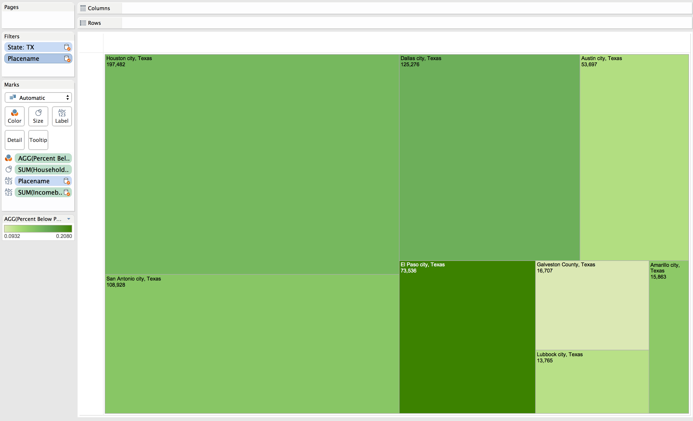
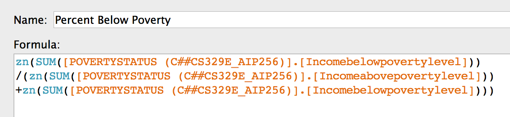
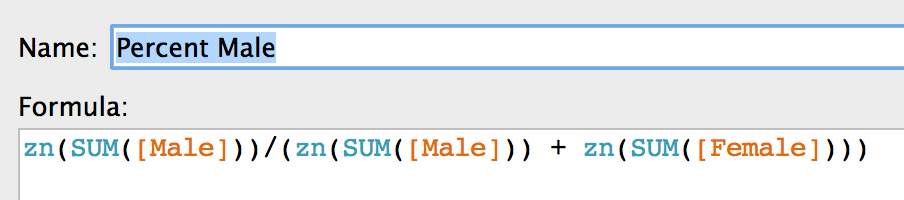

Elements Of Data Visualization: Tableau Project 3
===
__By Alex Cortez, Adam Hernandez, and Alex Pearce__

__GitHub__: https://github.com/alexpearce92/DV_TableauProject3.git

In this project, we utilize Tableau to blend two tables from Enigma. Our [first table](https://app.enigma.io/table/us.gov.census.acs.2007.1yr.children-relationship.household-type-including-living-alone-by-relationship?row=0&col=0&page=1) is contains information about different types of housholds across the US. Our [second table](https://app.enigma.io/table/us.gov.census.acs.2007.1yr.educational-attainment.poverty-status-by-sex-by-educational-attainment?row=0&col=12&page=1&documentView=false)has data concerning education level and the poverty level in the US. These two tables were joined over GeographicID.

###Blend 1

####With this first visualization we look at households for each state in the US. Each state is represented by a circle. The size of the circle is scaled by the number of foster children in households in each state. The color represents the number of nonrelatives in households for each state. Finally, the larger states have two numbers associated with them: the top number gives the income above the poverty level for households and the bottom number gives the income below the poverty level for each state. 

***

### Blend 2

####This is a simple blend to display the distribution of education attainment across all households.

***

### Blend 3

####In this chart we compare household income below and above the poverty line for each state. The width of each bar represents the number of households that have children and the color represents the number of households with less than high school education. It appears that California and Texas the most poor, most wealthy, and most children.

***

### Blend 4

####This chart looks at a selected number of states (TX, CA, WA, NY) and ranks them in a box-whisker plot based on the percent of the homes that live below the poverty line (calculation below). The color refers to the percent homes that contain males, red being more homes with males (calculation below). The size of the points refer to the number of homes with children. From this, we can see that Texas has the most male homes, many children, and also have the most below the poverty line. California has a population comparable to that of Texas. It has fewer male families, the most children, but has fewer poor. Alternatively, New York has the fewest male families, fewer children then the other two, but a higher poverty rate than California. Washington has the lowest population and the fewest poor.

Here is the table calculation we used for the measure Percent Below Poverty:

Here is the table calculation we used for the measure Percent Male:

