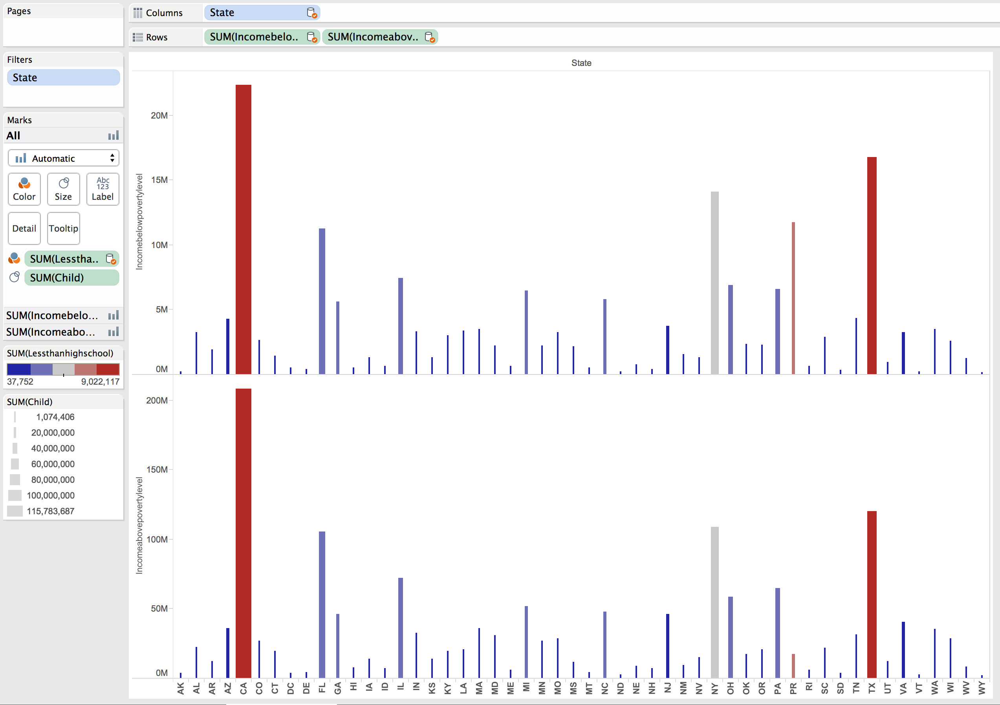
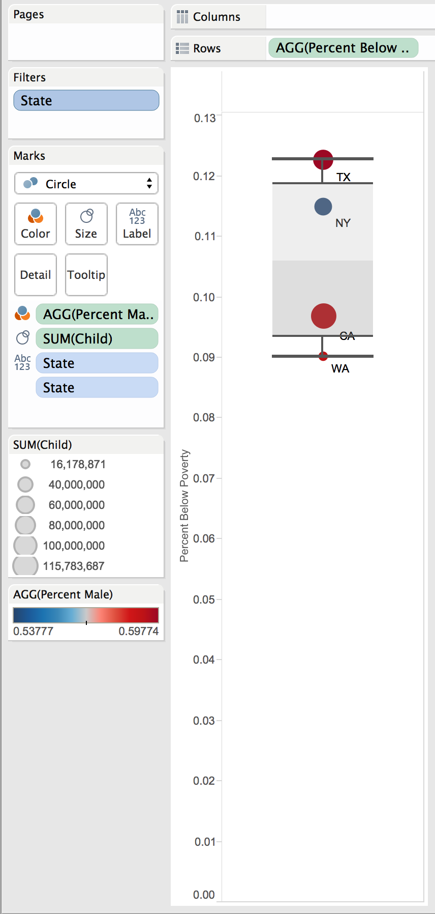

Elements Of Data Visualization: Tableau Project 3
===
__By Alex Cortez, Adam Hernandez, and Alex Pearce__

__GitHub__: https://github.com/alexpearce92/DV_TableauProject3.git

In this project, we utilize Tableau to blend two tables from Enigma. Our [first table](https://app.enigma.io/table/us.gov.census.acs.2007.1yr.children-relationship.household-type-including-living-alone-by-relationship?row=0&col=0&page=1) is contains information about different types of housholds across the US. Our [second table](https://app.enigma.io/table/us.gov.census.acs.2007.1yr.educational-attainment.poverty-status-by-sex-by-educational-attainment?row=0&col=12&page=1&documentView=false)has data concerning education level and the poverty level in the US.

###Blend 1

####Description

<!---->

***

### Blend 2

####Description

<!---->

***

### Blend 3

####In this chart we compare household income below and above the poverty line for each state. The width of each bar represents the number of households that have children and the color represents the number of households with less than high school education. It appears that California and Texas the most poor, most wealthy, and most children.

***

### Blend 4

####This chart looks at a selected number of states and compares housholds with high school graduates and those with college graduates. The color of each bar shows the percent number of housholds below the poverty line. We see that while Hawaii has few graduates from high school and college, they also have a very low poverty rate. 

